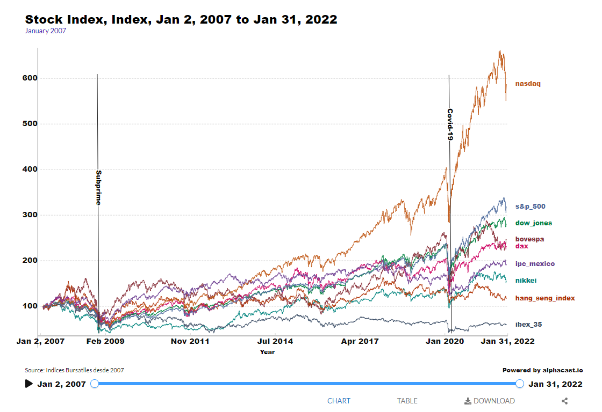

# Alphacast.io

Alphacast es una start-up en crecimiento que se encuentra construyendo una plataforma para facilitar el análisis económico y financiero. Think GitHub for Economists. Recopila información de cientos de fuentes de datos. Oficinas de Estadística, Bancos Centrales, Tesorería. Mercados y fuentes privadas. Ajuste estacional, suavizado, filtrado e interpolación, % PIB, conversión de divisas, precios constantes, YoY, MoM, WoW, medias móviles y mucho más.

## Web Scraping + Transform + Load Data

En este trabajo se transforman las series temporales de los principales indices bursátiles internacionales a base 100 en enero de 2007 hasta el 31/01/2022. La idea principal del trabajo es poder comparar las series de tiempo principalmente durante los dos shock que se vivieron en el periodo analizado, la crisis subprime y el Covid-19.

# Librerias Utilizadas

<ui>

<li>
{matplotlib}
</li>

<li>
{pandas_datareader}
</li>

<li>
{Pandas}
</li>

<li>
{alphacast}
</li>

</ui>

# Graficos final:

Películas:

